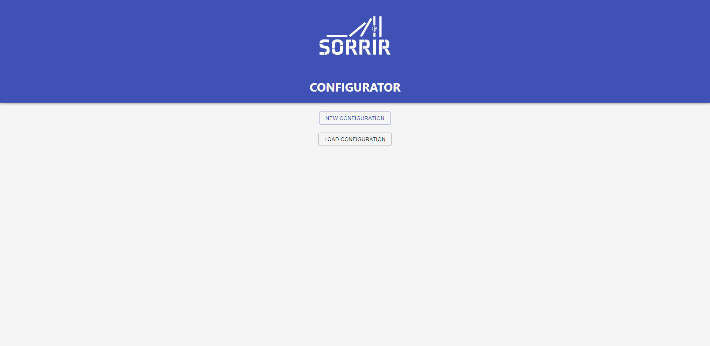

# SORRIR-Configurator

This repository contains the documentation and the code for the SORRIR configurator.
This configurator allows the graphical configuration for a component consisting of the different subcomponents their shadowmodes and the different degradation levels the component can be in.

A complete documentation about the project and the application can be found in the docs folder (and there in the report).

## Usage 
The application is a react application created with create-react-app and can be used accordingly.

`npm install` has to be done once before the first start to install all required dependencies for the application.

`npm start` will start the development server on port 3000 and allow the usage of the application. This will display the welcome screen of the application:

Examples for the configuration and the import can be found in the example folder.
